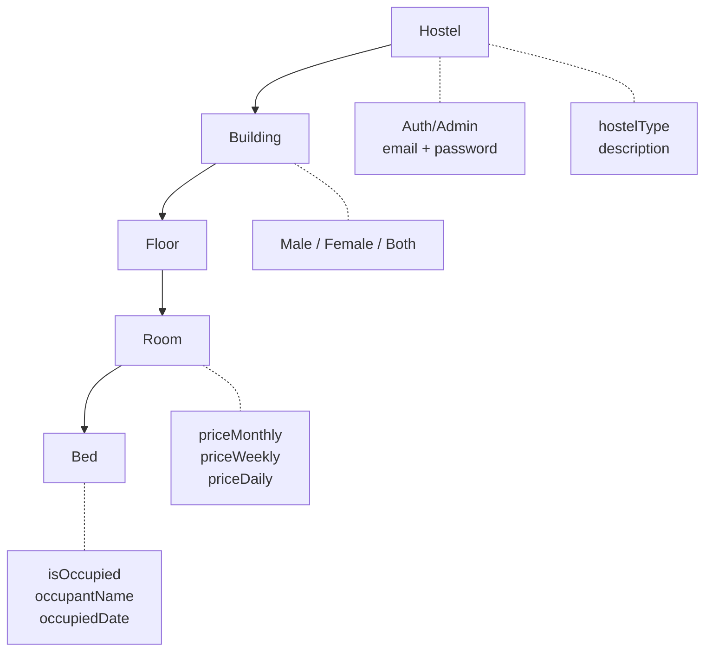

# HostelIn — Complete API Reference

> **Total: 9 route files · 23 endpoints**

---

## 1. Authentication (`/api/auth`)

### `/api/auth/register`
**File:** [route.ts](file:///c:/IT%20EMPIRE/IT%20Empire/hostel%20react/hostel-next/hostel-in/app/api/auth/register/route.ts)

| Method | Purpose | Body Params | Response |
|--------|---------|-------------|----------|
| `POST` | Register a new hostel + admin account. Creates the full hierarchy (buildings → floors → rooms → beds) in one shot. | `hostelName`, `city`, `town`, `registrationNumber`, `fullAddress`, `adminFullName`, `adminEmail`, `adminPassword`, `buildings[]`, `rooms[]`, `pricing[]`, `hostelImages[]`, `roomImages{}` | `{ success, hostelId, hostelName, adminFullName, adminEmail }` |

> [!NOTE]
> This is the only "onboarding" endpoint. It hashes the password with bcrypt, creates all nested entities, and maps pricing from the wizard's `pricing[]` array.

---

### `/api/auth/login`
**File:** [route.ts](file:///c:/IT%20EMPIRE/IT%20Empire/hostel%20react/hostel-next/hostel-in/app/api/auth/login/route.ts)

| Method | Purpose | Body Params | Response |
|--------|---------|-------------|----------|
| `POST` | Authenticate an admin by email + password | `email`, `password` | `{ success, hostelId, hostelName, adminFullName, adminEmail, city, town }` |

---

## 2. Admin Management (`/api/hostel`) — *Authenticated*

These endpoints power the admin dashboard. They all require a `hostelId` (passed via query param or in the body).

### `/api/hostel/buildings`
**File:** [route.ts](file:///c:/IT%20EMPIRE/IT%20Empire/hostel%20react/hostel-next/hostel-in/app/api/hostel/buildings/route.ts)

| Method | Purpose | Params / Body | Response |
|--------|---------|---------------|----------|
| `GET` | Fetch the **full nested hierarchy** (buildings → floors → rooms → beds) for a hostel. Also returns the hostel metadata. | Query: `hostelId` | `{ buildings: [...], hostel: {...} }` |
| `POST` | Create a new building | `{ hostelId, name, gender }` | `{ success, building: { id, name, gender, images, floors } }` |
| `PUT` | Update a building's name or gender | `{ buildingId, name?, gender? }` | `{ success }` |
| `PATCH` | Update a building's images (base64 array) | `{ buildingId, images[] }` | `{ success }` |
| `DELETE` | Delete a building + **cascade delete** all its floors, rooms, and beds | `{ buildingId }` | `{ success }` |

> [!IMPORTANT]
> The `GET` endpoint is the **primary data source** for the entire admin panel. It assembles the full hierarchy server-side.

---

### `/api/hostel/floors`
**File:** [route.ts](file:///c:/IT%20EMPIRE/IT%20Empire/hostel%20react/hostel-next/hostel-in/app/api/hostel/floors/route.ts)

| Method | Purpose | Body Params | Response |
|--------|---------|-------------|----------|
| `POST` | Add a floor to a building | `{ buildingId, floorNumber }` | `{ success, floor: { id, floorNumber, rooms } }` |
| `PUT` | Update a floor's number | `{ floorId, floorNumber }` | `{ success }` |
| `DELETE` | Delete a floor + **cascade delete** all its rooms and beds | `{ floorId }` | `{ success }` |

---

### `/api/hostel/rooms`
**File:** [route.ts](file:///c:/IT%20EMPIRE/IT%20Empire/hostel%20react/hostel-next/hostel-in/app/api/hostel/rooms/route.ts)

| Method | Purpose | Body Params | Response |
|--------|---------|-------------|----------|
| `POST` | Create a room + auto-generate beds | `{ floorId, roomNumber, bedCount?, images?, priceMonthly? }` | `{ success, room: { id, roomNumber, priceMonthly, beds, images } }` |
| `PUT` | Update a room's number or price | `{ roomId, roomNumber?, priceMonthly? }` | `{ success }` |
| `PATCH` | Update a room's images (base64 array) | `{ roomId, images[] }` | `{ success }` |
| `DELETE` | Delete a room + all its beds | `{ roomId }` | `{ success }` |

---

### `/api/hostel/beds`
**File:** [route.ts](file:///c:/IT%20EMPIRE/IT%20Empire/hostel%20react/hostel-next/hostel-in/app/api/hostel/beds/route.ts)

| Method | Purpose | Body Params | Response |
|--------|---------|-------------|----------|
| `POST` | Add a bed to a room | `{ roomId }` | `{ success, bed: { id, isOccupied } }` |
| `PUT` | Toggle bed occupied/vacant status | `{ bedId, isOccupied, occupantName? }` | `{ success }` |
| `DELETE` | Delete a bed | `{ bedId }` | `{ success }` |

---

### `/api/hostel/meta`
**File:** [route.ts](file:///c:/IT%20EMPIRE/IT%20Empire/hostel%20react/hostel-next/hostel-in/app/api/hostel/meta/route.ts)

| Method | Purpose | Body Params | Response |
|--------|---------|-------------|----------|
| `PUT` | Update global hostel profile settings (name, type, area, description, admin name) | `{ hostelId, hostelName?, hostelType?, town?, description?, adminFullName? }` | `{ success, hostel }` |

---

## 3. Public Discovery (`/api/hostels`) — *No Auth Required*

These endpoints power the homepage, search/listing page, and hostel detail page.

### `/api/hostels`
**File:** [route.ts](file:///c:/IT%20EMPIRE/IT%20Empire/hostel%20react/hostel-next/hostel-in/app/api/hostels/route.ts)

| Method | Purpose | Params | Response |
|--------|---------|--------|----------|
| `GET` | List all hostels with computed metadata (type, min price, gradient, amenities) for cards | None | `[{ id, name, area, city, price, rating, reviews, type, verified, image, grad, amenities, tags }]` |

> [!NOTE]
> Price is returned as a **formatted string** (`"12,000"` or `"Call for Price"`). Rating and reviews are currently placeholder values.

---

### `/api/hostels/[id]`
**File:** [route.ts](file:///c:/IT%20EMPIRE/IT%20Empire/hostel%20react/hostel-next/hostel-in/app/api/hostels/%5Bid%5D/route.ts)

| Method | Purpose | Params | Response |
|--------|---------|--------|----------|
| `GET` | Fetch a single hostel's full detail including nested buildings → floors → rooms → beds hierarchy and computed starting price | URL param: `id` (MongoDB ObjectId) | `{ ...hostel, id, buildings: [...], startingPrice }` |

> [!WARNING]
> Uses `context.params` as a `Promise` (Next.js 16 requirement). The `id` is validated as a MongoDB ObjectId before querying.

---

## Summary Table

| # | Endpoint | Methods | Auth | Used By |
|---|----------|---------|------|---------|
| 1 | `/api/auth/register` | POST | — | Registration Wizard |
| 2 | `/api/auth/login` | POST | — | Sign In Page |
| 3 | `/api/hostel/buildings` | GET, POST, PUT, PATCH, DELETE | Admin | Admin Dashboard |
| 4 | `/api/hostel/floors` | POST, PUT, DELETE | Admin | Admin Dashboard |
| 5 | `/api/hostel/rooms` | POST, PUT, PATCH, DELETE | Admin | Admin Dashboard |
| 6 | `/api/hostel/beds` | POST, PUT, DELETE | Admin | Admin Dashboard |
| 7 | `/api/hostels` | GET | — | Homepage, Find Hostels |
| 8 | `/api/hostels/[id]` | GET | — | Hostel Detail Page |
| 9 | `/api/hostel/meta` | PUT | Admin | Admin Settings Page |

---

## Data Model Hierarchy

